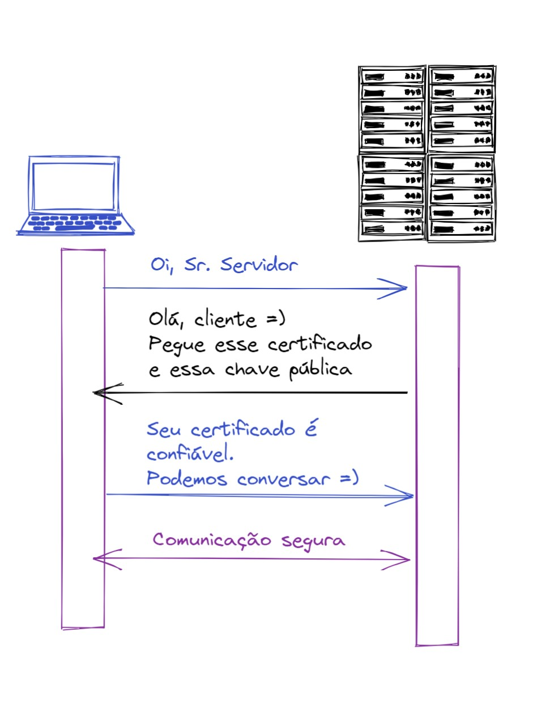
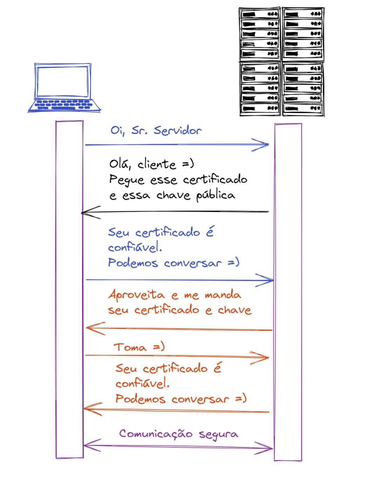
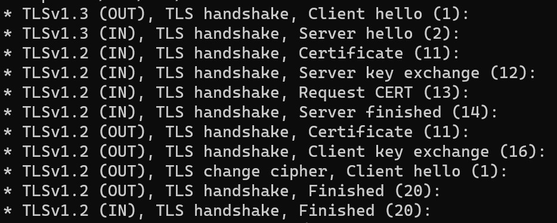
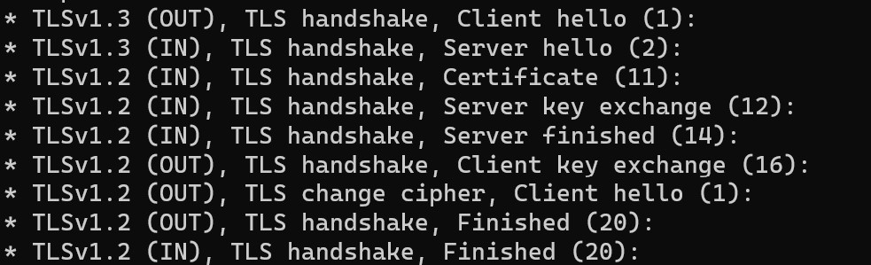

# mTLS

Hoje vamos falar sobre mTLS: Mutal Transporte Layer Security.

Em integrações de apis, servidores chamando servidor, podemos acrescentar uma camada de proteção além de clientId/clientSecret: podemos adicionar certificados dos dois lados absorvendo tudo que o TLS tem de melhor.

Imagine dois serviços que estão expostos na internet. A aplicação 1 está chamando a aplicação 2 através do protocolo https, onde o servidor prova que ele é confiável através de uma autoridade.

Normalmente, realizamos a integração da seguinte forma:

[](chamada-tls.jpg)

Qualquer cliente que souber as credenciais de autenticação pode realizar a chamada.

Vamos ver como funciona com mTLS:

[](chamada-mtls.jpg)

Com mTLS, além da prova do servidor, o cliente também precisa provar que ele é confiável. Sendo assim, temos a segurança:
- TLS a partir do servidor
- TLS a partir do cliente
- Autenticação

Algumas questões interessantes:
- O certificado do servidor não tem nenhuma relação com o certificado do cliente. Pode estar relacionado a qualquer common name.
- O servidor aceita comunicação com o cliente se o certificado do cliente for assinado pela autoridade de certificados de cliente configurada no servidor.
- O servidor aceita qualquer certificado de cliente assinado pela autoridade configurada.
- O certificado do cliente provavelmente será assinado por uma autoridade interna da organização para que os certificados de cliente aceitos pelo servidor estejam sob controle.

TLS x mTLS

[](tls.jpg)
[](mtls.jpg)

O mTLS tem o fluxo normal do TLS somado a uma validação por parte do servidor, do certificado informado pelo cliente através do ca root configurado no servidor, dessa forma o cliente também consegue provar ser quem ele deve ser para o servidor.

# Mão na massa

Vamos criar um servidor nginx que exige validação de certificado do cliente a partir de um CA confiável.

Para executar o exemplo será necessário:
- Terminal shell
- docker
- openssl cli

## Configurar host

Apontar o endereço test.localdev.me para 127.0.0.1 na sua máquina

## Gerar Certificados

```sh
# Gerar certificado do servidor
openssl req -x509 -nodes -days 365 -newkey rsa:2048 -keyout server.key -out server.crt -subj '/CN=test.localdev.me/O=test.localdev.me'

# Gerar CA root que assinará o certificado do cliente e ficará no servidor
openssl req -x509 -sha256 -newkey rsa:4096 -keyout ca.key -out ca.crt -days 356 -nodes -subj '/CN=Minha autoridade cliente'

# Gerar csr para gerar certificado do cliente
openssl req -new -newkey rsa:4096 -keyout client.key -out client.csr -nodes -subj '/CN=Meu cliente'

# Assinar csr com o CA e gerar certificado do cliente
openssl x509 -req -sha256 -days 365 -in client.csr -CA ca.crt -CAkey ca.key -set_serial 02 -out client.crt
```

Ao executar o comando, serão gerados os  certificados e chaves que iremos utilizar:
- server.crt
- server.key
- ca.crt
- client.crt
- client.key

## Criar e rodar o servidor

Criar a configuração mTLS para o nginx através do arquivo nginx-setup-mtls.conf:
```nginx
server {
  listen 443 ssl;
  server_name  test.localdev.me;
  ssl_certificate /etc/nginx/certs/server.crt;
  ssl_certificate_key /etc/nginx/certs/server.key;

  ssl_client_certificate /etc/nginx/mtls/ca.crt;
  ssl_verify_client on;
  ssl_verify_depth  3;

  ssl_protocols             TLSv1 TLSv1.1 TLSv1.2;

  location / {
      root /usr/share/nginx/html;
      index index.html index.htm;
      try_files $uri $uri/ /index.html;
  }
}
``` 

Criar o Dockerfile:
```dockerfile
FROM nginx:1.23.0
COPY nginx-setup-mtls.conf /etc/nginx/conf.d/default.conf
COPY server.crt /etc/nginx/certs/
COPY server.key /etc/nginx/certs/
COPY ca.crt /etc/nginx/mtls/

CMD ["/bin/sh",  "-c", "exec nginx -g 'daemon off;'"]
```

Build e run do servidor
```sh
docker build . -f Dockerfile -t nginx:mtls
docker run -d --name mtls-nginx -p 443:443 nginx:mtls
```
Ao executar o comando será iniciado o servidor nginx:mtls com porta 443 exposta e será configurado o certificado:
- server.crt
- server.key

E também terá a autoridade confiável para certificados do cliente:
- ca.crt

## Realizar chamada do cliente no servidor

### Via curl

Chamar o servidor informando o client.crt e client.key e ignorando que o certificado dele é auto assinado:
```sh
curl -k -v https://test.localdev.me/index.html --key client.key --cert client.crt
```

Podemos ver a troca de certificados:

[](troca.jpg)

OBS: Caso o servidor não exigisse o certificado do cliente, o log da requisição seria:

[](troca.jpg)


### Resultado esperado

- Chamar o servidor e não informar certificado de cliente:
"400 No required SSL certificate was sent"

- Chamar o servidor e informar certificado do cliente inválido:
"400 The SSL certificate error"

- Chamar o servidor e informar certificado do cliente assinado pela autoridade configurado no servidor:
"Welcome to nginx!" (Página padrão do nginx)

### Via C#
```c#
var certificado = X509Certificate2.CreateFromPemFile("client.crt", "client.key");
var handler = new HttpClientHandler();
handler.ClientCertificateOptions = ClientCertificateOption.Manual;
handler.ClientCertificates.Add(certificado);
var client = new HttpClient(handler);
var result = await client.GetAsync("https://test.localdev.me/index.html");
```

Se quiserem o código fonte completo, podem acessar meu [github](https://github.com/willsbctm/mtls-teste).

Espero que possam avaliar o uso de mTLS nas integrações que estão trabalhando e comentários/dúvidas/sugestões são muito bem vindos!


